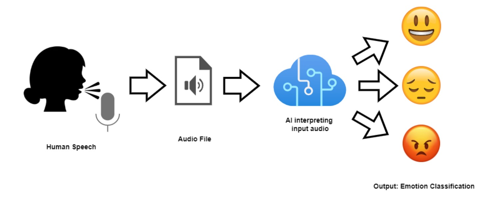

<h1 align="center">
 Speech Emotion Recognition
</h1>

<p align="center">
 
</p>

A deep learning project that classifies eight emotions from speech audio using a Convolutional Neural Network (CNN). Trained on the RAVDESS dataset, this repository demonstrates end-to-end audio processing—from feature extraction to model inference—ideal for applications like virtual assistants, mental health monitoring, and human-computer interaction.

---

## 🚀 Table of Contents

* [✨ Features](#-features)
* [🗂️ Project Structure](#️-project-structure)
* [🛠️ Installation](#️-installation)
* [▶️ Usage](#️-usage)
* [📊 Results & Visualizations](#-results--visualizations)
* [🔮 Future Improvements](#-future-improvements)
* [🤝 Contributing](#-contributing)
* [📄 License](#-license)

---

## ✨ Features

* **Dataset**: RAVDESS audio dataset (1,440 samples across 8 emotions).
* **Feature Extraction**:

  * 231-dimensional feature vectors
  * MFCCs, Chroma, Mel Spectrograms, Zero-Crossing Rate, Spectral Contrast
* **Model Architecture**: CNN built in PyTorch with:

  * 2 Convolutional Layers
  * Batch Normalization & Dropout
  * Fully Connected Layers for classification
* **Performance**:

  * Single CNN: \~72.5% accuracy
  * Ensemble of 3 CNNs: \~74.2% accuracy
* **Prediction**: Function to infer emotion from new audio files

---

## 🗂️ Project Structure

```bash
├── .gitignore
├── LICENSE
├── README.md
├── img.jpg
├── requirements.txt
├── SpeechEmotionCNN.ipynb

```

* **`.gitignore`**: Excludes caches and checkpoints
* **`LICENSE`**: MIT open-source license
* **`README.md`**: Project documentation (this file)
* **`img.jpg`**: Sample process diagram
* **`requirements.txt`**: For project dependencies
* **`SpeechEmotionCNN.ipynb`**: Notebook covering data loading, feature extraction, training, evaluation, and prediction

---

## 🛠️ Installation

1. **Clone the repository**

   ```bash
   git clone https://github.com/X-XENDROME-X/speech-emotion-recognition.git
   cd speech-emotion-recognition
   ```

2. **Set up a virtual environment (optional but recommended)**

   ```bash
   python3 -m venv venv
   source venv/bin/activate  # On Windows: venv\Scripts\activate
   ```

3. **Install dependencies**

   ```bash
   pip install -r requirements.txt
   ```

4. **Prepare the RAVDESS dataset**

   * The notebook will auto-download from Zenodo if `./data/ravdess/` is empty
   * Or [download manually](https://zenodo.org/record/1188976) and unzip into `./data/ravdess/`

---

## ▶️ Usage

1. **Launch Jupyter Notebook**

   ```bash
   jupyter notebook SpeechEmotionCNN.ipynb
   ```

2. **Run through the cells**:

   * Load and preprocess audio files
   * Extract features with Librosa
   * Train CNN model(s)
   * Evaluate and visualize results
   * Save model weights and label encoder

3. **Predict on new audio**

   ```python
   from predict import predict_emotion_pytorch

   model_path = 'speech_emotion_model_pytorch.pth'
   encoder_path = 'label_encoder.joblib'
   audio_file = 'path/to/audio.wav'

   predicted_emotion = predict_emotion_pytorch(
       audio_file,
       model_path,
       encoder_path,
       device='cpu'
   )
   print(f"Predicted Emotion: {predicted_emotion}")
   ```

---

## 📊 Results & Visualizations

* **Accuracy**: 72.5% (single model) ➔ 74.2% (ensemble)
* **Insights**:

  * High accuracy on distinct emotions (e.g., angry, happy)
  * Lower performance for neutral/calm due to class imbalance (addressed with weighted loss)
* **Visuals**:

  * Waveform plots
  * Confusion matrices
  * Training & validation accuracy/loss curves

---

## 🔮 Future Improvements

* Experiment with Transformer-based architectures (e.g., Audio Spectrogram Transformers)
* Integrate pre-trained audio networks (e.g., Wav2Vec)
* Add extra features: pitch, prosody, formants
* Test & fine-tune on other datasets (e.g., TESS, CREMA-D)
* Deploy as a REST API or in a real-time application

---

## 🤝 Contributing

Contributions are welcome! To contribute:

1. Fork the repository
2. Create a feature branch (`git checkout -b feature-name`)
3. Commit your changes (`git commit -m 'Add new feature'`)
4. Push to the branch (`git push origin feature-name`)
5. Open a Pull Request

Please adhere to the existing code style and include tests where applicable.

---

## 📄 License

This project is licensed under the MIT License. See the [LICENSE](LICENSE) file for details.
